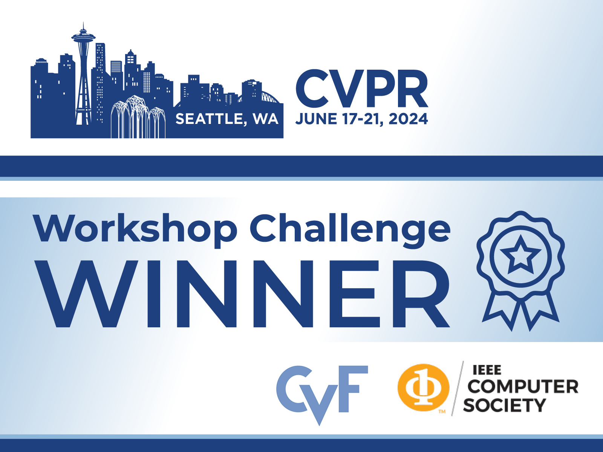
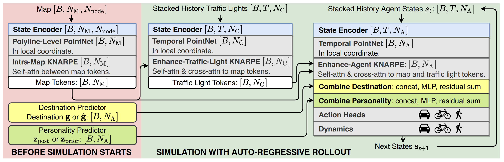

# TrafficBots V1.5: TrafficBots + HPTR

This repository includes an updated version of [TrafficBots](https://github.com/zhejz/TrafficBots), which replaces the old [SceneTransformer](https://arxiv.org/abs/2106.08417) backbone with the new [HPTR](https://github.com/zhejz/HPTR) architecture and achieves better performance.

In this repository you will find the training, validation, testing and visualization code for the Waymo Open Sim Agents Challenge ([WOSAC](https://waymo.com/open/challenges/2024/sim-agents/)) and the Waymo Open Dataset Challenges ([WOMD](https://waymo.com/open/challenges/2024/motion-prediction/)) for motion prediction. 

<p align="center">
     
     <br/><B>TrafficBots V1.5</B> won the 3rd place in Waymo Open Sim Agents Challenge at the CVPR 2024 Workshop on Autonomous Driving.<br/>
</p>

<p align="center">
     
     <br/> <B>TrafficBots V1.5</B> for the closed-loop simulation of traffic agents. It is a simple baseline that combines TrafficBots and HPTR.<br/>
</p>

> **TrafficBots V1.5: Traffic Simulation via Conditional VAEs and Transformers with Relative Pose Encoding**            
> [Zhejun Zhang](https://zhejz.github.io/), [Christos Sakaridis](https://people.ee.ethz.ch/~csakarid/) and [Luc Van Gool](https://insait.ai/prof-luc-van-gool/).<br/>
> 
> [Waymo Open Dataset Challenges 2024 Winners](https://waymo.com/open/challenges/)<br/>
> [CVPR 2024 Workshop on Autonomous Driving](https://cvpr2024.wad.vision/)<br/>
> [arXiv Paper](https://arxiv.org/abs/2406.10898)

```bibtex
@article{zhang2024trafficbots,
  title={TrafficBots V1.5: Traffic Simulation via Conditional VAEs and Transformers with Relative Pose Encoding},
  author={Zhang, Zhejun and Sakaridis, Christos and Van Gool, Luc},
  journal={arXiv preprint arXiv:2406.10898},
  year={2024}
}
```

## Setup Environment
- Create the [conda](https://docs.conda.io/en/latest/miniconda.html) environment by running `conda env create -f environment.yml`.
- Install [Waymo Open Dataset](https://github.com/waymo-research/waymo-open-dataset) API manually because the pip installation of version 1.6.4 is not supported on some linux, e.g. CentOS. Run 
  ```
  conda activate traffic_bots
  wget https://files.pythonhosted.org/packages/14/99/7d36e6fd9ea4d676d1187c1698f6d837d151ea04fc3172c5c6e9dfa2806d/waymo_open_dataset_tf_2_12_0-1.6.4-py3-none-manylinux_2_24_x86_64.manylinux_2_28_x86_64.whl
  mv waymo_open_dataset_tf_2_12_0-1.6.4-py3-none-manylinux_2_24_x86_64.manylinux_2_28_x86_64.whl waymo_open_dataset_tf_2_12_0-1.6.4-py3-none-any.whl
  pip install --no-deps waymo_open_dataset_tf_2_12_0-1.6.4-py3-none-any.whl
  rm waymo_open_dataset_tf_2_12_0-1.6.4-py3-none-any.whl
  ```
- We use [WandB](https://wandb.ai/) for logging. You can register an account for free.
- Be aware
  - We use 4 *NVIDIA RTX 4090* for training and for evaluation. The training takes at least 5 days to converge, whereas the validation and testing takes around 2-3 days.
  - We cannot share pre-trained models according to the [terms](https://waymo.com/open/terms) of the Waymo Open Motion Dataset.

## Prepare Datasets
- Download the [Waymo Open Motion Dataset](https://waymo.com/open/data/motion/). We use v1.2.0
- Run `python scripts/pack_h5_womd.py` or use [bash/pack_h5.sh](bash/pack_h5.sh) to pack the dataset into h5 files to accelerate data loading during the training and evaluation.
- You should pack three datasets: `training`, `validation` and `testing`. Packing the `training` dataset takes around 2 days. For `validation` and `testing` it takes a few hours. 
- Run `python scripts/pickle_val_scenario.py` to pack the validation dataset into pickle files to accelerate data loading during the validation. This step is necessary and cannot be replaced by `pack_h5` because it is required by the validation API of WOSAC.

## Training
Please refer to [bash/train.sh](bash/train.sh) for the training. The default model corresponds to the [leaderboard submission entry](https://waymo.com/open/challenges/sim-agents/results/5ea7a3eb-7337/1716472677635000/). It has 10M parameters and is trained for 6 epochs, i.e. 0.2 * 6 = 1.2 epochs on the complete WOMD training split. The training takes 5 days on 4 RTX 4090.


## Validation and Testing
Please refer to [bash/submission.sh](bash/submission.sh) for the validation and testing.

Download the file from WandB and submit to the [Waymo Motion Prediction Leaderboard](https://waymo.com/open/challenges/2024/motion-prediction/) or the [Waymo Sim Agents Leaderboard](https://waymo.com/open/challenges/2024/sim-agents/).

## License

This software is made available for non-commercial use under a creative commons [license](LICENSE). You can find a summary of the license [here](https://creativecommons.org/licenses/by-nc/4.0/).

## Acknowledgement

This work is funded by Toyota Motor Europe via the research project [TRACE-Zurich](https://trace.ethz.ch) (Toyota Research on Autonomous Cars Europe).